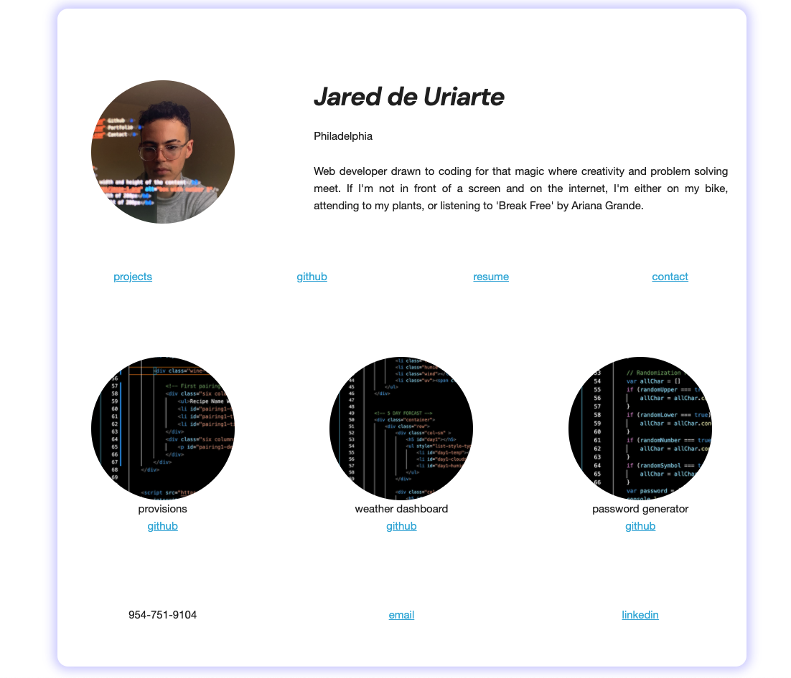

# Portfolio

## Description
A portfolio app to demonstarte my technical work and experience, offer a brief introduction about myself, and provide contact information. 

## Deployment
- [Deployed site](https://jareddeuriarte.github.io/updated-portfolio/)
- [GitHub Repo](https://github.com/jareddeuriarte/updated-portfolio)

### Resources Used
- [Skeleton CSS Framework](https://skeleton-framework.github.io/)
- [Centering img tag within div](https://stackoverflow.com/questions/54877537/img-tag-center-align-in-div-tag-horizontal)
- [Downloadable pdf with a tag](https://www.w3schools.com/tags/att_a_download.asp)
- [Clickable image how to!](https://www.w3schools.com/tags/tryit.asp?filename=tryhtml_link_image)
- [Remove all style from link (hint hint 😉)](https://stackoverflow.com/questions/23262711/a-href-remove-all-styling)
